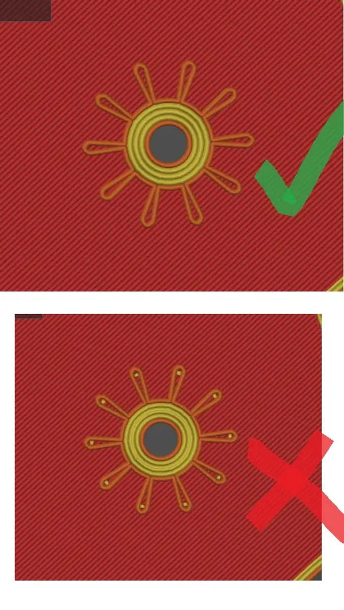

# Printing Parts
An FDM printer is assumed. I have not tried resin printing, I suspect it would not be strong enough. I use a Prusa Mk3s and Mk4. PETG doesn't print especially well on a mini (bowden extruder) but I expect any well calibrated machine with a direct drive extruder to be suitable..

Most parts are best printed in PETG as it's strong and doesn't warp easily. Some decorative parts (hands, dial) could probably be printed in PLA without any issue, but I have used PETG so I can print them on a textured sheet.

A few parts are best printed in ASA for strength - so far this is only for mainspring driven clocks.

I have prusa printers and use PrusaSlicer, so these instructions assume that. I think these principles should apply to most slicers and printers, but you may need to do some investigation to find the exact names of settings in other slicers.

# Wheels (gears)
The wheels and pinions are by far the hardest part to print. If you want to print a clock I recommend starting with an arbor to check your printer is up to the task.

You need to be able to print PETG with minimal stringing. I've discovered lower temperatures and decent filament to be the best way to reduce stringing from the printer, and carefully slicing to avoid too many stops and starts to reduce stringing from the gcode.

Only printing one object at once also helps reduce stringing and blobbing. "Complete Individual Objects" works very well for printing multiple parts of an arbor at the same time.

## Slicing Tips
The teeth of both the wheels (big gears) and leaves of pinions (teeth of the small gears) need to be printed in continuous perimeter. If there are small bits filling gaps, this is very lightly to produce stringing. 

Most gears should print fine simply by disabling Gap Fill in Prusaslicer, however a few can still require some tweaking, usually the pinions. Each pinion has a corresponding "pinion_STL_modifier" file which can be imported to change slicing settings for just one section of the model. In Prusaslicer this is by right clicking on a shape, Add Modifier -> Load. Then you want to set the infil to 0, the top and bottom layers to 0 and the perimeter to 1. This will result in a hollow pinion with just the inner and outer perimeter. Alternatively you can tweak the perimeter and external perimeter width ever so slightly.    