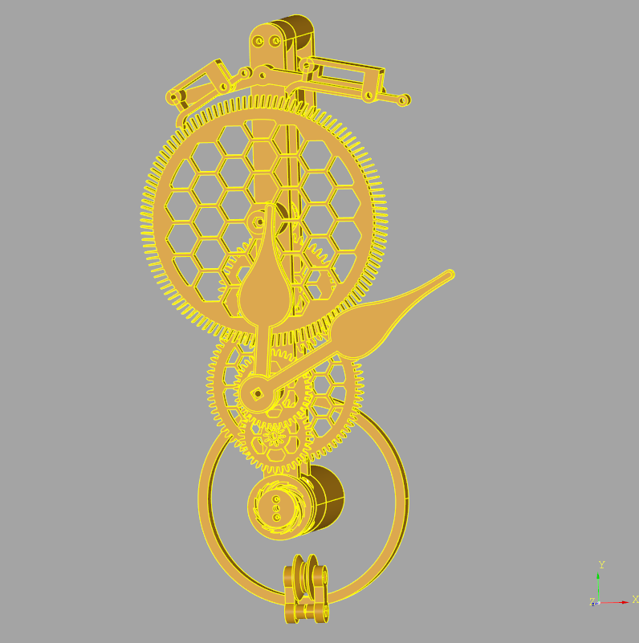

# 3DPrintedClocks
A sprawling library of python code for 3D printing clocks and accessories. CadQuery is used to produce the 3D models (exported to STL) and numpy is used for much of the vector arithmetic.

Licenced under GNU GPL-3.0-or-later. 

Most of the code is part of a library intended for generating complete clocks to be 3D printed. Deadbeat and grasshopper escapements are complete and functional. There was a (not great) recoil escapement which has since been deprecated and removed.

See the wall_clock_* python scripts in the root directory for examples of generating complete clocks. Clocks 5 and earlier were from when the library was in a state of flux and are unlikely to work without checking out old tags. All later clocks will generate a preview if opened in the CadQuery editor. 

## Acknowledgements

I'm standing on the shoulders of giants and would not have made anything like the progress I have without the following:

[Hugh Sparks' write-up on cycloidal gears](https://www.csparks.com/watchmaking/CycloidalGears/index.jxl).

A small amount of source code is from [Dr Rainer Hessmer's gear generator](http://hessmer.org/gears/CycloidalGearBuilder.html) (MIT Licence).

[The Modern Clock by Ward L Goodich](https://www.gutenberg.org/ebooks/61494) (and project Gutenberg!).

[Computer Aided Design of Harrison Twin Pivot and Twin Balance Grasshopper Escapement Geometries by David Heskin](https://soptera.files.wordpress.com/2013/10/cad-twin-pivot-and-balance2.pdf) (His [other documents](https://soptera.wordpress.com/downloads/) and blog are worth looking at too).

An honourary mention to [Brian Law's Wooden Clocks](https://www.woodenclocks.co.uk/). I would like to stress that my designs are my own, but I have taken inspiration and motivation from Brian's website.

## Using the Library
The heart of a clock is its escapement. First create an escapement object. For details of what the parameters for the deadbeat and grasshopper do, see their relevant sections below.

### Anchor Escapement
Deadbeat is implemented, recoil is not (yet).

I found [an excellent write up on designing deadbeat escapements](https://www.ocf.berkeley.edu/~wwu/cgi-bin/yabb/YaBB.cgi?board=riddles_general;action=display;num=1437253052) _after_ I'd designed mine. If you're starting from scratch, I'd recommend it. This is very similar to the approach I decided on.

### Grasshopper Escapement
By default the grasshopper will attempt to meet Harrison's stipulations and use a few binary searches to generate compliant geometry. This is slow, so I recommend using GrasshopperEscapement.get_harrison_compliant_grasshopper() to fetch one using pre-calculated set of parameters.

## Other Bits
### Cuckoo_bits
This can generate a pendulum rod + pendulum bob fixing for a cuckoo clock. Designed to be the same as traditional cuckoo clocks, and therefore as hard to set accurately.

Working whistles and bellow parts also!

### Leaves
Can generate a reasonable cuckoo clock leaf, designed for gluing to the pendulum bob fixing.

### Clock
Beginnings of an entire clock from scratch. 