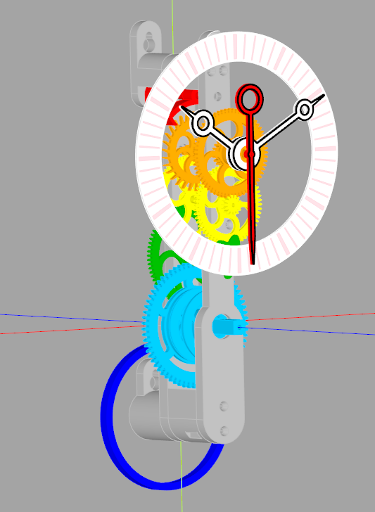

# 3DPrintedClocks
A sprawling library of python code for 3D printing clocks and accessories. CadQuery is used to produce the 3D models (exported to STL) and numpy is used for much of the vector arithmetic.

Licenced under GNU GPL-3.0-or-later.

Most of the code is part of a library intended for generating complete clocks to be 3D printed. Deadbeat and grasshopper escapements are complete and functional. There was a (not great) recoil escapement which has since been deprecated and removed.

See the wall_clock_* python scripts in the root directory for examples of generating complete clocks. Clocks 5 and earlier were from when the library was in a state of flux and are unlikely to work without checking out old tags. All later clocks will generate a preview if opened in the CadQuery editor. 

Documentation is lacking as this is a hobby project and I'm easily distracted. This readme aims to provide a general overview and the code is commented with my intentions throughout. However a fairly good understanding of how a clock works is assumed, so I'd recommend at least skim-reading The Modern Clock if you are interested in using it to produce your own clock.

Note: it turns out "arbor", in its horological sense, doesn't have a "u". This change is rolling out slowly throughout the codebase.



# Acknowledgements

I'm standing on the shoulders of giants and would like to acknowledge the following resources:

[Hugh Sparks' write-up on cycloidal gears](https://www.csparks.com/watchmaking/CycloidalGears/index.jxl).

A small amount of source code is from [Dr Rainer Hessmer's gear generator](http://hessmer.org/gears/CycloidalGearBuilder.html) (MIT Licence).

[The Modern Clock by Ward L Goodich](https://www.gutenberg.org/ebooks/61494) (and project Gutenberg!). Especially the chapter on escapements.

[Computer Aided Design of Harrison Twin Pivot and Twin Balance Grasshopper Escapement Geometries by David Heskin](https://soptera.files.wordpress.com/2013/10/cad-twin-pivot-and-balance2.pdf) (His [other documents](https://soptera.wordpress.com/downloads/) and blog are worth looking at too).

An honourary mention to [Brian Law's Wooden Clocks](https://www.woodenclocks.co.uk/). I would like to stress that my designs are my own, but I have taken inspiration and motivation from seeing what Brian has demonstrated to be possible.

I found [an excellent write up on designing deadbeat escapements](https://www.ocf.berkeley.edu/~wwu/cgi-bin/yabb/YaBB.cgi?board=riddles_general;action=display;num=1437253052) _after_ I'd designed mine. If you're starting from scratch, I'd recommend it. This is very similar to the approach I decided on.

# Using the Library
Below I will go through the main files and describe how to use the classes required to design your own clock.

## Escapements (clocks/escapements.py)
The heart of a clock is its escapement. This provides power to the pendulum and also regulates the time.

First create an escapement object. For details of what the parameters for the deadbeat and grasshopper do, see their relevant sections below.

### Anchor Escapement
Deadbeat is implemented, recoil is not (yet). Greatest efficiency is achieved if the pallets are at 45 degrees. At the moment this is done by eye and I've settled on the following configurations for 30 and 40 toothed escape wheels:
```python
#for 40 teeth (1 RPM with a period of 1.5s, approx 55cm pendulum)
drop =1.5
lift =3
lock=1.5
escapement = AnchorEscapement(drop=drop, lift=lift, teeth=40, lock=lock, style=AnchorStyle.CURVED_MATCHING_WHEEL)

# for 30 teeth (1RPM with a period of 2s, approx 1m pendulum)
lift=4
drop=2
lock=2
escapement = AnchorEscapement(drop=drop, lift=lift, teeth=30, lock=lock)
```

I intend to create a method that would automatically calculate lift and drop for any given number of teeth as well as adjusting the shape of the teeth.

Note that the style of anchor is configured here. The default has straight arms.

### Grasshopper Escapement
Using default arguments the grasshopper will attempt to meet Harrison's stipulations (via David Heskin's interpretation) and use a few binary searches to generate compliant geometry. This is slow, so I recommend using `GrasshopperEscapement.get_harrison_compliant_grasshopper()` to fetch one using pre-calculated set of parameters.

The grasshopper is only supported on the front of the clock - it is too large to fit between the plates.

## Going Train
The going train is the name given to the series of gears that link the power (weight on a chain or cord) to the escapement. The small gears are called pinions and the large gears are called wheels. In a gearbox for a motor you'll usually be gearing down to increase torque and decrease speed. On a clock you're gearing up from the power source to increase the run time of the clock.

Gear sizes are defined by [module size](https://en.wikipedia.org/wiki/List_of_gear_nomenclature#Module). `moduleReduction` can be configured to result in decreasing module size along the going train. Each wheel needs to be smaller than the last to fit and module reduction is an easy way to help calculate a valid train. 

Smaller pendulum periods (aprox < 1s) will probably need 4 wheels to find a valid train which isn't physically huge.

Using degreased and oiled bearings clocks can run reliably with ~40uW. With greased bearings you will need at least ~65uW. There is always a trade off to be had: heavier weights provide more power and in theory make the clock more reliable - except they also require more robust plates and can cause the plates to bend, making the clock less reliable. Newer designs use M4 machine screws through the whole length of the pillars which help with rigidity.

Finally `genGears` creates the Arbor objects which represent the physical gears that will be printed. Reducing the thickness of the gears reduces friction (so we can run with a lighter weight) but also reduces their strength. Therefore I usually have thick gears for the chain wheel and reduce the thickness towards the escapement.
```python
moduleReduction=0.9

#relatively simple eight day clock, needs one chain wheel in order to provide enough runtime
#Large pendulum period so it can calculate a valid train with only 3 wheels
train = GoingTrain(pendulum_period=2, wheels=3, escapement=escapement, maxWeightDrop=1200, chainAtBack=False, chainWheels=1, hours=7.5*24)

#find a valid combination of gears that meets the constraints specified. This can get slow with 4 wheels, but is usually fast with only 3.
train.calculateRatios(max_wheel_teeth=130, min_pinion_teeth=9, wheel_min_teeth=60, pinion_max_teeth=15, max_error=0.1, moduleReduction=moduleReduction)

#configure what type of power the going train will have and this will calculate the gear ratios to provide the requested runtime for the maxWeightDrop
#genChainWheels2 uses the newer pocket chain wheel which is strong and reliable enough to cope with heavy duty chain for eight day clocks
train.genChainWheels2(COUSINS_1_5MM_CHAIN, ratchetThick=6, arbourD=4, looseOnRod=False, prefer_small=True, preferedDiameter=30)

train.genGears(module_size=0.9, moduleReduction=moduleReduction, thick=2.4, thicknessReduction=0.9, chainWheelThick=4, pinionThickMultiplier=3, style=gearStyle,
               chainModuleIncrease=1, chainWheelPinionThickMultiplier=2, pendulumFixing=pendulumFixing, stack_away_from_powered_wheel=True)

#print to console how much power we can expect for the calculated chain wheel
train.printInfo(weight_kg=2)
```

## Motion Works
The motion works gears down from the minute hand to the hour hand and provides a means to mount both the hour and minute hands.

```python
motionWorks = MotionWorks(extra_height=10, style=GearStyle.ARCS, thick=3, compensateLooseArbour=True, compact=True, inset_at_base=clock.MotionWorks.STANDARD_INSET_DEPTH)
```

## Other Bits
### Cuckoo_bits
This can generate a pendulum rod + pendulum bob fixing for a cuckoo clock. Designed to be the same as traditional cuckoo clocks, and therefore as hard to set accurately.

Working whistles and bellow parts also!

### Leaves
Can generate a reasonable cuckoo clock leaf, designed for gluing to the pendulum bob fixing.

### Clock
Beginnings of an entire clock from scratch.

# Multi-Colour on a non Multi-Material Printer
This is surprisingly easy to do and looks great when printed on a textured sheet. Since I don't own a multi-material printer I've used a variation on a technique I found on a [blog post](http://schlosshan.eu/blog/2019/03/02/prusa-i3-mk3-real-multicolour-prints-without-mmu/) that works with PrusaSlicer and my Prusa Mk3:

- I added a new printer to prusa slicer, and configured it with multiple extruders.
- I then added the custom G-code for "Tool change G-code" to be M600. This tells the printer to request the user to change the filament.
- When exporting gcode, I manually edit the file to remove the first M600 call - otherwise the printer asks you to change the filament immediately.
- Import all the STL files for the object at once - it should ask you if you want to treat them as a single object. Say yes!
- The object should be printed "upside down", so the manual filament changes are over fairly quickly, and the rest of the object can print without intervention.
- Using a wipe tower helps ensure there aren't any gaps or splurges in your print, but you can reduce the purge quantity a lot.
- When changing filament on the first layer, take special care to look for and remove any long stringing common with PETG.
- When changing filament, grab the extruded waste with pliers, but don't tug it away until you've confirmed it's succeeded and the print head starts to move away! It will extrude a short length after you've pressed the button to confirm.
- When changing filament, after you've removed one filament, check to see if the nozzle needs a clean before inserting the next filament.

Printing in PETG on a textured bed, with the 'front' of the object facing down results in a very neat and tidy front surface. With well tuned z-offset and elephant's foot then there will be no gaps and very little colour blurring at the boundaries between colours.
