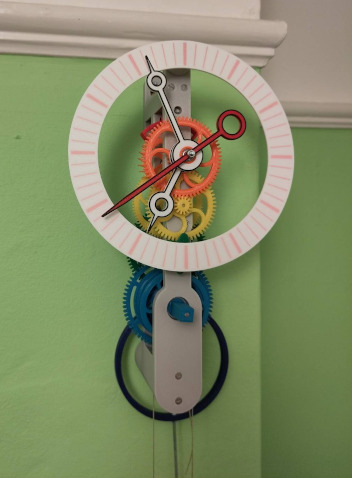
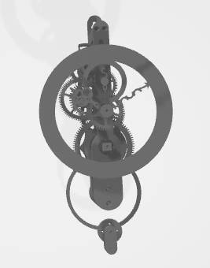

# 3DPrintedClocks

[//]: # (TODO little table of thumbnails with links to bigger images with python script to make the thumbnails?)
[//]: # (![Clock 12 Render]&#40;images/wall_clock_12_small.png "Clock 12 Render"&#41;)



[//]: # (![Clock 07 Render]&#40;images/wall_clock_07_render_small.png "Clock 07 Render"&#41;)


A sprawling library of python code for 3D printing clocks and accessories. CadQuery is used to produce the 3D models (exported to STL) and numpy is used for much of the vector arithmetic. I use the Cadquery editor (cq-editor) to visualise the clock as I'm developing. 

Most of the code is part of a library intended for generating complete clocks to be 3D printed. Deadbeat, grasshopper, recoil and brocot escapements are complete and functional.

See the wall_clock_* and mantel_clock* python scripts in the root directory for examples of generating complete clocks. Older clocks may not work without checking out old tags, as I have occasionally broken backwards compatibility. All later clocks will generate a preview if opened in the CadQuery editor. 

Documentation is lacking as this is a hobby project and I'm easily distracted. This readme was mostly written with my future self in mind: it aims to provide a general overview. The code is commented with my intentions throughout so for more information I recommend digging into the relevant class. However a fairly good understanding of how a clock works is assumed, so I'd recommend at least skim-reading [The Modern Clock](https://www.gutenberg.org/ebooks/61494) if you are interested in using it to produce your own clock.

## Licence
This source describes Open Hardware and is licensed under the CERN-OHL-S v2.

 You may redistribute and modify this source and make products using it under 
 the terms of the CERN-OHL-S v2 or any later version (https://ohwr.org/cern_ohl_s_v2.txt).         
                                                                              
 This source is distributed WITHOUT ANY EXPRESS OR IMPLIED WARRANTY,          
 INCLUDING OF MERCHANTABILITY, SATISFACTORY QUALITY AND FITNESS FOR A         
 PARTICULAR PURPOSE. Please see the CERN-OHL-S v2 for applicable conditions.  
                                                                              
 Source location: https://github.com/MrBunsy/3DPrintedClocks                                        
                                                                              
 As per CERN-OHL-S v2 section 4, should you produce hardware based on this    
 source, You must where practicable maintain the Source Location visible      
 on the external case of the clock or other products you make using this      
 source.    

My entirely non-lawyerly understanding is that this is like the GPL for hardware design (since the STLs are the output of the software, I cannot use the more conventional GPL to cover them). I don't wish to limit anyone's use of this library, but I do wish to prevent clocks developed using the library becoming closed source. If you distribute (paid or free) STLs for a clock, or a printed clock, you must also provide the source code used to generate those STLs.

# Acknowledgements

I'm standing on the shoulders of giants and would like to acknowledge the following resources:

[Hugh Sparks' write-up on cycloidal gears](https://www.csparks.com/watchmaking/CycloidalGears/index.jxl).

A small amount of source code is from [Dr Rainer Hessmer's gear generator](http://hessmer.org/gears/CycloidalGearBuilder.html) (MIT Licence).

[The Modern Clock by Ward L Goodich](https://www.gutenberg.org/ebooks/61494) (and project Gutenberg!). Especially the chapter on escapements.

[Computer Aided Design of Harrison Twin Pivot and Twin Balance Grasshopper Escapement Geometries by David Heskin](https://soptera.files.wordpress.com/2013/10/cad-twin-pivot-and-balance2.pdf) (His [other documents](https://soptera.wordpress.com/downloads/) and blog are worth looking at too).

An honourary mention to [Brian Law's Wooden Clocks](https://www.woodenclocks.co.uk/). I would like to stress that my designs are my own, but I have taken inspiration and motivation from seeing what Brian has demonstrated to be possible.

I found [an excellent write up on designing deadbeat escapements](https://www.ocf.berkeley.edu/~wwu/cgi-bin/yabb/YaBB.cgi?board=riddles_general;action=display;num=1437253052) _after_ I'd designed mine. If you're starting from scratch, I'd recommend it. This is very similar to the approach I decided on.

# Summary of all clocks
All the clocks (printable and unfinished) are [summarised here](./Clocks.md)

# Printing Parts
See [Printing Parts](Printing.md)

# Assembling Clocks
See [Assembly Instructions](Assembly.md)

# Using the Library
Below I will go through the main files and give a rough overview of how to use the classes required to design your own clock. Much of the design is in flux, especially the SimpleClockPlates which tend to require more options and refactoring with every new design. I try and ensure comments are sufficient to understand the intent of each class and their major functions.

I assume a fairly detailed knowledge of the workings of clocks through the code and readme. I recommend at least a cursory read through The Modern Clock if you're starting from scratch (although probably skip chapters II and VII, there are better explanations of the mathematics behind clocks and most of it isn't necessary for gaining an overview).

## Escapements (clocks/escapements.py)
The heart of a clock is its escapement. This provides power to the pendulum and also regulates the time.

First create an escapement object. For details of what the parameters for the deadbeat and grasshopper do, see their relevant sections below.

### Anchor Escapement
Deadbeat is implemented, recoil is not (yet). Greatest efficiency is achieved if the pallets are at 45 degrees. At the moment this is done by eye and I've settled on the following configurations for 30 and 40 toothed escape wheels:

```python
#for 40 teeth (1 RPM with a period of 1.5s, approx 55cm pendulum)
drop =1.5
lift =3
lock=1.5
escapement = clock.AnchorEscapement(drop=drop, lift=lift, teeth=40, lock=lock, style=clock.AnchorStyle.CURVED_MATCHING_WHEEL)

# for 30 teeth (1RPM with a period of 2s, approx 1m pendulum)
lift=4
drop=2
lock=2
escapement = clock.AnchorEscapement(drop=drop, lift=lift, teeth=30, lock=lock)
```


I intend to create a method that would automatically calculate lift and drop for any given number of teeth as well as adjusting the shape of the teeth.

Note that the style of anchor is configured here. The default has straight arms.

### Grasshopper Escapement
Using default arguments the grasshopper will attempt to meet Harrison's stipulations (via David Heskin's interpretation) and use a few binary searches to generate compliant geometry. This is slow, so I recommend using `GrasshopperEscapement.get_harrison_compliant_grasshopper()` to fetch one using pre-calculated set of parameters.

The grasshopper is only supported on the front of the clock - it is too large to fit between the plates.

The geometry calculations in this class are a direct implementation of David Heskin's write up and use his naming schemes.


## Going Train
The going train is the name given to the series of gears that link the power (weight on a chain or cord) to the escapement. The small gears are called pinions and the large gears are called wheels. In a gearbox for a motor you'll usually be gearing down to increase torque and decrease speed. On a clock you're gearing up from the power source to increase the run time of the clock.

Gear sizes are defined by [module size](https://en.wikipedia.org/wiki/List_of_gear_nomenclature#Module). `moduleReduction` can be configured to result in decreasing module size along the going train. Each wheel needs to be smaller than the last to fit and module reduction is an easy way to help calculate a valid train. 

You can configure the use of a pulley with `usePulley`. This changes the calculations for the runtime of the clock and will affect the plates slightly.

Smaller pendulum periods (aprox < 1s) will probably need 4 wheels to find a valid train which isn't physically huge.

30 hours is about the most you can achieve from a clock without a chainwheel (powered wheels are interchangable called chainwheels or powered wheels throughout, because the chain was the first implemented). For eight day clocks you will need one chainwheel.

Using degreased and oiled bearings clocks can run reliably with ~40uW. With just degreased stainless steel, even lower. With greased bearings (as you can usually buy them) you will need at least ~65uW. There is always a trade off to be had: heavier weights provide more power and in theory make the clock more reliable - except they also require more robust plates and can cause the plates to bend, making the clock less reliable. Newer designs use M4 machine screws through the whole length of the pillars which help with rigidity.

A variety of different power sources are supported. All are weight driven (for now, I have plans for springs):
 - ChainWheel: The very first implemented, works for lightweight chains only. Deprecated - use ChainWheel2 instead, it's better and has no drawbacks.
 - ChainWheel2: A much better chainwheel, with a suitably strong chain it can easily support many kilos.
 - CordWheel
   - With key: a key can be used to wind the weight back up. This results in a more narrow wheel (closer together and thus stronger plates) but requires access for the key. See clocks like wall clock 12.
   - Without key: two cords, one with the weight and the other to pull to wind the weight back up. Only been used on 30hour clocks (see wall clock 07).
 - RopeWheel: Multiple attempts to use a rope (tried hemp as it had most friction) with a counterweight and friction. It _does_ work but requires too much counterweight for me to explore the idea further. See wall clock 11.

Finally `genGears` creates the Arbor objects which represent the physical gears that will be printed (note that these will be wrapped up in ArborsForPlates later, which provides dimensions not yet known at this stage). Reducing the thickness of the gears reduces friction, so we can run with a lighter weight, but also reduces their strength. Therefore I usually have thick gears for the chain wheel and reduce the thickness towards the escapement.

```python
moduleReduction = 0.9

# relatively simple eight day clock, needs one chain wheel in order to provide enough runtime
# Large pendulum period so it can calculate a valid train with only 3 wheels
train = clock.GoingTrain(pendulum_period=2, wheels=3, escapement=escapement, maxWeightDrop=1200, chainAtBack=False, chainWheels=1, hours=7.5 * 24)

# find a valid combination of gears that meets the constraints specified. This can get slow with 4 wheels, but is usually fast with only 3.
train.calculate_ratios(max_wheel_teeth=130, min_pinion_teeth=9, wheel_min_teeth=60, pinion_max_teeth=15, max_error=0.1, module_reduction=moduleReduction)

# configure what type of power the going train will have and this will calculate the gear ratios to provide the requested runtime for the maxWeightDrop
# genChainWheels2 uses the newer pocket chain wheel which is strong and reliable enough to cope with heavy duty chain for eight day clocks
train.gen_chain_wheels2(COUSINS_1_5MM_CHAIN, ratchetThick=6, arbourD=4, looseOnRod=False, prefer_small=True, preferedDiameter=30)

train.gen_gears(module_size=0.9, module_reduction=moduleReduction, thick=2.4, thickness_reduction=0.9, powered_wheel_thick=4, pinion_thick_multiplier=3, style=gearStyle,
                powered_wheel_module_increase=1, powered_wheel_pinion_thick_multiplier=2, pendulum_fixing=pendulumFixing, stack_away_from_powered_wheel=True)

# print to console how much power we can expect for the calculated chain wheel
train.print_info(weight_kg=2)
```
An example output from printInfo for a 4-wheel going train with short pendulum:

>{'train': [[72, 10], [75, 9], [60, 27]]}  
>pendulum length: 0.13977573912159377m period: 0.75s  
>escapement time: 27.0s teeth: 36  
>Powered wheel diameter: 29  
>[[86, 10]]  
>layers of cord: 2, cord per hour: 1.2cm to 1.1cm min diameter: 29.0mm  
>Cord used per layer: [1319.468914507713, 680.531085492287]  
>runtime: 178.6hours using 2.0m of cord/chain for a weight drop of 1000. Chain wheel multiplier: 8.6 ([[86, 10]])  
>With a weight of 3kg, this results in an average power usage of 45.8μW  

Finding the expected power usage for a given weight is useful - it will show if the clock is viable. Using degreased and oiled bearings can result in a reliable clock with a power of 40μW, but if this is your first attempt at printing a clock I recommend aiming for more like 80μW.

## Motion Works
The motion works gears down from the minute hand to the hour hand and provides a means to mount both the hour and minute hands.

The cannon pinion holds the minute hand and slots through the centre of the hour holder. The cannon pinion is held onto the arbor by friction - a pair of nuts locked against each other with a spring washer at the base, and another pair of nuts locked against each other on the front of the hands. This allows you to set the time independently of the going train. 

Adding extra_height will make the motion works longer than the minimum - useful if you need the hands further from the clock plates (or dial)


`inset_at_base` provides a hole in the bottom of the cannon pinion large enough to fit the nuts and spring washer. This enables the motion works to be more snug to the plate. You will need to manually specify the arbor distance to generate larger motion works with `.calculateGears(arbourDistance=30)` for the cannon pinion to be large enough for this to work.
If a bearing is provided to the motion works, it will generate space to slot a bearing into the top and bottom of the cannon pinion. This is for slotting the second hand through the motion works. This will assume you need a time setting arbor (the flower gear).

If the arbor is going to sit above the cannon pinion `compensateLooseArbour` will elongate the teeth of the gears slightly. This helps prevent the hour hand slipping if the clock plates droop slightly over time.

Compact motion works may require two nylock screws to hold the arbor in the right place.

```python
# motion works as used in the earlier clocks, with caps on the pinions
motionWorks = clock.MotionWorks(extra_height=10, compact=False)

# a motion works that could be used with a centred second hand
motion_works = MotionWorks(compact=True, bearing=get_bearing_info(3), extra_height=20)
motion_works.calculate_size(arbor_distance=30)
```

## Pendulum Bob

The Pendulum class generates the bob and the ring (for avoiding the hands on front mounted pendulums, or the bottom pillar on rear pendulums).

This class can produce two types of bob: solid and hollow. The hollow bob is designed to be filled with something heavy (I use steel shot) and have the lid screwed in place.


```python
pendulum = clock.Pendulum(hand_avoider_inner_d=100, bob_d=80, bob_thick=15)
```

## Dial
Dials consist of an outer ring and an optional inner seconds-hand ring. Each can have different styles. 

Eye-clocks with eyes that look left and right with the pendulum swing are supported, but with only one implementation currently.


Top and bottom fixings to the clock plates are both optional (but you'll need at least one). These are overriden if using compact clock plates with a filled-in dial. 

```python
dial = clock.Dial(outside_d=180, bottom_fixing=True, top_fixing=True, style=clock.DialStyle.ROMAN, seconds_style=clock.DialStyle.CONCENTRIC_CIRCLES)
```

## Clock Plates
The plates tie everything together. They arrange the arbors, provide wall fixings and hold the dial. From clock 4 onwards they are backwards compatibility has been preserved, with all new features being optional. The different options available are best demonstrated in the various working clock designs.

By default the motion works arbor is directly bellow the cannon pinion. This can be overriden with `motion_works_angle_deg` (which replaces the deprecated option `motionWorksAbove`).

There are three main styles of clock plate:
- `VERTICAL`: The default options provide a vertical plate strong enough for a 30 hour clock (see clock 4).
- `ROUND`: A circular layout is possible, but results in an offset pendulum and hands (see clock 5)
- `COMPACT`: Similar to `VERTICAL` but will place some arbors out to the side to reduce the total height. See clock 22.

For vertical eight day clocks, the option `heavy` will increase the radius of the bottom pillar and `extraHeavy` will increase the top pillar and plate width as well as increasing the bottom pillar shape to slightly engulf the chain wheel.

`pendulumFixing` sets the way the pendulum is attached to the anchor. Working options are `FRICTION_ROD` and `DIRECT_ARBOUR_SMALL_BEARINGS`. Friction rod has both the anchor and pendulum holder attached to the same rod with friction, and the beat can be set by adjusting the pendulum holder. "Direct Arbor" extends the arbor with the crutch and has the pendulum holder as part of a special collet which slots onto the arbor. The beat can only be set by bending the pendulum rod or adjusting the angle of the clock on the wall, but it should already be in beat if the pendulum and clock are perfectly vertical. See clocks 12 and 19 for the first working direct arbor implementation. 

`direct_arbor_d` will set the radius of the arbor if the pendulum fixing is `DIRECT_ARBOUR_SMALL_BEARINGS`. The default has proven to be acceptable.

By default the pendulum is at the front and the back plate is directly against the wall. This is controlled with `pendulumAtFront` and `backPlateFromWall` will result in what is called the "wall standoff" which generates extra pillars which are attached to the back of the back plate. Clock 14 was the first use of `backPlateFromWall` for the grasshopper escapement.

`fixingScrews` expects a MachineScrew. This defaults to countersunk M3 screws, but most clocks will need M4 if you want to easily find screws long enough to pass through the front, back and wall standoff.

`escapementOnFront` will mount the escape wheel and anchor on the front of the clock. This was done for the grasshoppers (Clocks 14, 15 and 17) but should be supported for anchor escapements too.

`extraFrontPlate` is deprecated, but was an attempt to add another plate to help hold the escape wheel in place for a front mounted escapement.

`chainThroughPillarRequired` forces the bottom pillar to be wide enough for the chain (or cord) to pass through the pillar. Generally you will want this to be true for a chain driven clock to prevent the chain falling off if the clock is left running for long enough.

`centred_second_hand` routes the escape wheel rod through the centre of the motion works. See Clocks 12 and 19. This requires the motion works to be configured with a bearing.

`pillars_separate` defaults to true and results in the pillars between the plates being separate parts. If it is false they are printed attached to the back plate. To re-print old designs without a wall standoff (pre clock 14) this will probably need to be true in order for there to be somewhere to put the nuts for the fixing screws without compromising strength.

`dial` accepts a Dial object. `configure_dimensions` on the dial will be called to set the support length. `override_fixing_positions` will be called if the dial is "filled in" (tony) and the plates are configured with two bottom pillars. 

`huygens_wheel_min_d`: If the going train is configured with a "huygens wheel" (my term for the clock using [Huygen's maintaining power](https://en.wikipedia.org/wiki/Maintaining_power#Huygens)) you can override the diameter of the extra chain wheel. By default it will be to fit on top of the bottom pillar

`allow_bottom_pillar_height_reduction` is experimental and intended to reduce the height of the clock plates if the plates are `extraHeavy`. It is still untested.

By default there is only one `bottom_pillars`, but it can be set to 2. See Clock 22 for an example of this. Useful for shorter pendulums and more compact clock designs.

`centre_weight` is experimental, intended to move the chain wheel to the side so the weight (when no pulley is used) is in the centre of the clock. it is untested.

`screws_from_back` will place the nuts for the fixing screws that hold the plates together at the front of the clock, rather than the back.

`endshake` is how much extra space there is between the plates for the arbors to "shake". I recommend increasing above the default of 1mm for heavy clocks as the arbors can jam between the plates if the plates droop slightly.

```python
pendulumSticksOut = 10
backPlateFromWall = 30

# clock 20's clock plates
plates = clock.SimpleClockPlates(train, motionWorks, pendulum, plate_thick=9, back_plate_thick=10, pendulum_sticks_out=pendulumSticksOut, name="Wall 20", style=clock.GearTrainLayout.COMPACT,
                                 motion_works_above=True, heavy=True, extra_heavy=True, pendulum_fixing=pendulumFixing, pendulum_at_front=False,
                                 back_plate_from_wall=backPlateFromWall, fixing_screws=clock.MachineScrew(metric_thread=4, countersunk=True),
                                 chain_through_pillar_required=True, pillars_separate=True, dial=dial, bottom_pillars=1, motion_works_angle_deg=45,
                                 allow_bottom_pillar_height_reduction=False, endshake=1.5)
```

## Hands

A large variety of hand styles exist, with the following options:

- Outline of a different colour, or set to 0 for no outline. Doesn't work with small cuckoo hands or baroque hands.
- Centred second hand. Only produces good second hands with `SIMPLE_ROUNDED` and `BREGUET`
- Chunky: makes the hand generally wider, some hands don't look good without a dial behind them (only affects `BREGUET`)

`getHandDemo()` will produce models of all hand styles for a quick overview.


```python
# clock 12's hands with a centred second hand
hands = clock.Hands(style=clock.HandStyle.BREGUET, minuteFixing="circle", minuteFixing_d1=motionWorks.get_minute_hand_square_size(), hourfixing_d=motionWorks.get_hour_hand_hole_d(),
                    length=dial.outside_d * 0.45, thick=motionWorks.minute_hand_slot_height, outline=1, outlineSameAsBody=False, second_hand_centred=True, chunky=True)
```

## Pulleys
Two pulleys exist, a simple `LightweightPulley` with a wheel that can be printed in one piece or the more heavy duty `BearingPulley` which fits a bearing inside the pulley wheel. For eight day clocks with a heavier weight I recommend the `BearingPulley`.

The `LightweightPulley` supports either slotting a steel tube into the wheel (`use_steel_rod=True`), or running with plastic on the machine screw directly. I suspect the steel tube is overkill because this is only used on lightweight clocks anyway, but it might make it possible to use with heavier weights. 

Both pulleys use a standard cuckoo weight hook to provide a hook for the weight.

```python
pulley = clock.BearingPulley(diameter=train.powered_wheel.diameter, bearing=clock.get_bearing_info(4), wheel_screws=clock.MachineScrew(2, countersunk=True, length=8))
pulley = LightweightPulley(diameter=plates.get_diameter_for_pulley(), use_steel_rod=False)
```


## Assembly
The `Assembly` is used for generating previews of the clock for inspection to ensure the geometry is correct and the clock is printable. The going train and plates logic isn't perfect, it is possible to produce designs where things overlap or would be impossible to assemble. The ability to see an assembled clock rendered helps avoid discovering these problems after you've started printing.

`get_clock()` provides a CaqQuery workplane that represents the entire assembled clock. This can be exported to STL.
`show_clock()` only works in CQ-editor but provides a coloured preview of the clock.




## Other Bits
### Cuckoo_bits
This can generate a pendulum rod + pendulum bob fixing for a cuckoo clock. Designed to be the same as traditional cuckoo clocks using friction rather than a nut to hold the bob in place. As such, it's about as accurate as traditional cuckoos!

Working whistles and bellow parts also!

### Leaves
Can generate a few types of leaves, used for cuckoo clocks and the Christmas clock.

# Slicing Gears
The gears need careful configuration when slicing - rarely do default settings result in good gears.
 - Check no small bits of perimeter or infill in the teeth/leaves. Sometimes this can be achieved by slightly adjusting the perimeter and external perimeter widths. May need to import *_pinion_STL_modifier.stl and add settings:
   - 1 Perimeter
   - No top or bottom solid layers
   - 0% Fill density
 - Elephant foot needs to be correct (note that for the MK4 0.25 nozzle, prusaslicer has 0 elephant foot by default! 0.1mm was sufficient)
 - Manually place seam to be between gaps in teeth
 - Extra perimeter and minimum shell thickness at top and bottom for strength.
 - Usually Classic slicer is better than Arachne
 - Disable gap fill to reduce stringing
 - I've used `Avoid crossing perimeters`. I'm undecided how important it is.

# General reliability 
A ticklist of things I need to remember to check when building a clock:
 - The motion works must be cleanly printed. The hour holder should be free to spin over the cannon pinion. MotionWorks cannon_pinion_to_hour_holder_gap_size can be increased if need be.
 - Check all wheel and pinion teeth for any stringing or 3D printed detritus. Even a small bit of plastic swarf in the wrong pinion can jam the gear train.
 - Remember to add any washers required - escapements on the front will need a washer to prevent the anchor rubbing up against the inside of a plate. Chain driven power wheels also require a washer.
 - Check rods used for arbors are straight. More of a problem for  M2, but M3 can also be bent.

# Bearings
After much experimentation I've arrived at the conclusion that the best bearings to use are fully degreased stainless steel deep groove bearings. Degreased and oiled chrome bearings are significantly cheaper, but don't seem to reliably last as long. Bearings as they arrive are packed with grease, and just using them like that works, but adds a lot more friction. On some older clocks I've observed the grease slowly leaking out. 

EZO make very high quality stainless steel bearings and I've been using these for the pendulum and escape wheel. Cheaper no-name brand stainless steel bearings seem pretty good when degreased as well, but with a bit more variability. I've assembled some clocks entirely from cheaper stainless steel bearings, but mostly I'm using EZO for the top of the train and no-name for the rest. I'm still using grease-packed bearings for the power wheel as larger stainless steel bearings become prohibitively expensive.

# Multi-Colour on a non Multi-Material Printer
This is surprisingly easy to do and looks great when printed on a textured sheet. Since I don't own a multi-material printer I've used a variation on a technique I found on a [blog post](http://schlosshan.eu/blog/2019/03/02/prusa-i3-mk3-real-multicolour-prints-without-mmu/) that works with PrusaSlicer and my Prusa Mk3:

- I added a new printer to prusa slicer, and configured it with multiple extruders.
- I then added the custom G-code for "Tool change G-code" to be M600. This tells the printer to request the user to change the filament.
- When exporting gcode, I manually edit the file to remove the first M600 call - otherwise the printer asks you to change the filament immediately.
- Import all the STL files for the object at once - it should ask you if you want to treat them as a single object. Say yes!
- The object should be printed "upside down", so the manual filament changes are over fairly quickly, and the rest of the object can print without intervention.
- Using a wipe tower helps ensure there aren't any gaps or splurges in your print, but you can reduce the purge quantity a lot.
- When changing filament on the first layer, take special care to look for and remove any long stringing common with PETG.
- When changing filament, grab the extruded waste with pliers, but don't tug it away until you've confirmed it's succeeded and the print head starts to move away! It will extrude a short length after you've pressed the button to confirm.
- When changing filament, after you've removed one filament, check to see if the nozzle needs a clean before inserting the next filament.

Printing in PETG on a textured bed, with the 'front' of the object facing down results in a very neat and tidy front surface. With well tuned z-offset and elephant's foot then there will be no gaps and very little colour blurring at the boundaries between colours.
