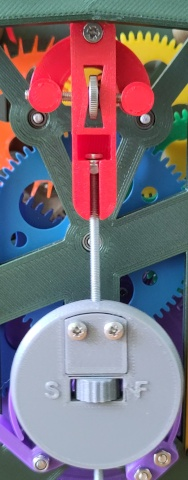
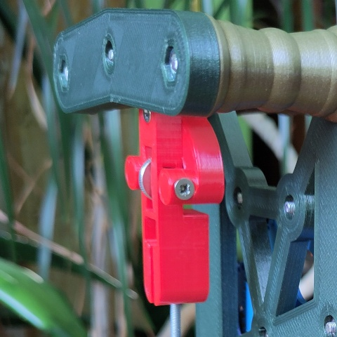
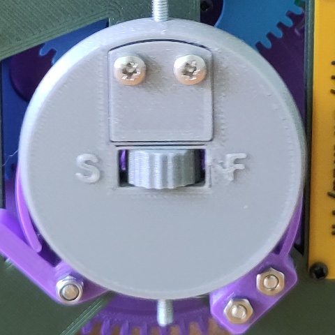

# Setting up a Pendulum Clock

Pendulum clocks keep best time and are most reliable if they're in beat, see [Setting the Beat](#setting-the-beat). This means there is an even gap between a "tock" and a "tick". The clock needs to be fixed to a wall with two screws so it can't easily be knocked out of beat while winding.

Once firmly fixed to the wall and in beat you can adjust the rate of the clock to keep good time. Once regulated these 3D printed clocks can achieve accuracies of better than a minute a week, so long as the temperature changes aren't too extreme. See [how to adjust the rate](#adjusting-the-rate).

An eight day clock needs winding once a week. They will run for longer than a week, but spring clocks will not keep time as well if wound irregularly and they may not run for a full fortnight.

## Hanging on the Wall
All wall clocks hang on two screws to have a drill template with 6mm holes. Using a spirit level to keep the template vertical, and a sharp masonary drill bit it's not too hard to have the clock hang vertically. Don't worry too much as the beat can be adjusted even if the clock isn't perfectly level.

You can hang the clock with only one screw, but it's very easy to knock the clock out of beat slightly when winding, and so the clock won't keep as good time.

Once the clock is on the wall you can hang the pendulum, wind the clock fully, and give the pendulum a gentle push to start the clock ticking.

The top of the pendulum slots into the back of the pendulum hanger. It will drop down slightly so the nut is resting in a hole.

## Setting the Beat

Once the clock is fixed to the wall with two screws it won't be able to move so the only way to set the beat is to adjust the thumb nut on the pendulum hanger at the back of the clock.

Listening to the tick-tock is how I set the beat. If it sounds like a horse galloping (ticktock....ticktock....ticktock) then the clock is out of beat. If the ticks and tocks sound even (tick...tock...tick...tock) then the clock is in beat.

Adjusting the thumb nut about half a turn in one direction will be enough to hear a difference. If it sounds worse (more like a gallop) then turn the nut the other way. If it improves, but still isn't in beat then turn it a little bit more. It's easy to turn too far and go out of beat in the other direction. Don't worry, just adjust it back again.

## Adjusting the Rate

The length of the pendulum sets the rate of the clock and the nut in the centre of the pendulum bobs allows adjusting the effective length of the pendulum. The longer the pendulum, the slower the clock. The pendulum bob nut can be adjusted by hand. Only a quarter of a turn is enough to make a difference of half a minute or so over a week, so if the clock is only slightly fast or slow, make very small adjustments!

The back of the pendulum has a reminder of which way to turn the nut. Turn towards the 'S' to slow the clock down or the 'F' to speed the clock up.

If the clock gains or loses more than a minute a day it's worth adjusting once a day. Once the clock is keeping roughly the right time, leave it to run for a week after winding up and only adjust after a full week. It doesn't take more than a handful of adjustments to get it keeping good time.

## Setting the Time

If you need to set the time you can simply turn the minute hand in either direction and rotate through the hours required. Don't try and turn the hour hand as it will end up out of alignment with the minute hand. If the hour and minute hand have come out of alignment, don't worry, just set the minute hand to 12 and with a small amount of force turn the hour hand to the 12 as well, make sure that the hour hand is still vertical so it won't crash into the minute hand. Then you can turn the minute hand to set the correct time.

If the clock has a moon complication you can set the moon in the same way. The moon is friction fit so a small nudge will be enough to rotate it. The moon complication models an average lunar month, so it is accurate long term, but on any given day it may be slightly out as the real moon's orbit is not circular.

## Why has my Clock Stopped?

Common reasons your clock has stopped:

 - It hasn't been wound recently!
 - Something is blocking or has blocked the pendulum from swinging freely.
 - (Weight driven clocks) Something is blocking or has blocked the weight from falling freely.
 - The clock is significantly out of beat. See [Setting the Beat](#setting-the-beat).
 - The hands have been knocked and have crashed into each other - try and straighten them out.

## Transporting a Clock

I recommend you remove the pendulum before trying to move the clock, even just to move it from one wall to another. A freely swinging pendulum when the clock is moved can damage the escape wheel teeth.

## Long Term Maintainence

These clocks are still experimental - the longest any has run is just short of three years. The PETG wheels show minimal signs of wear, but the bearings have had their original grease removed and replaced with oil, so at some point (I expect 5 to 10 years) they will need re-oiling, if not outright replacing. I use two small drops of pure synthetic 0W-40 motor oil per bearing.

If for any reason you need to dismantle the clock you must let down the mainspring first in a spring clock. There is a lot of energy stored in a clock spring and if not safely let down it will be released all at once, damaging the clock and potentially injuring you! A let down adapter is provided for each spring clock, suitable for using in normal mainspring let down tools. For a weight driven clock, simply removing the weight is enough for the clock to be safe.

