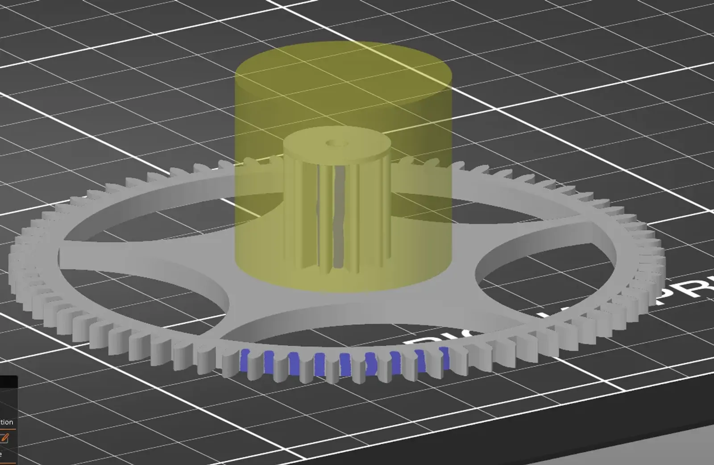
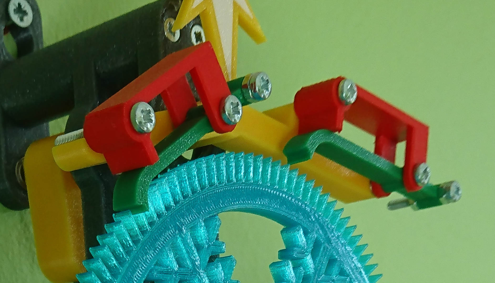
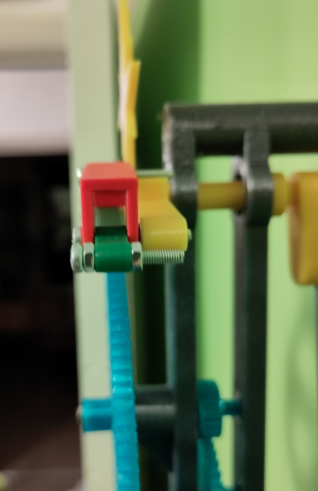
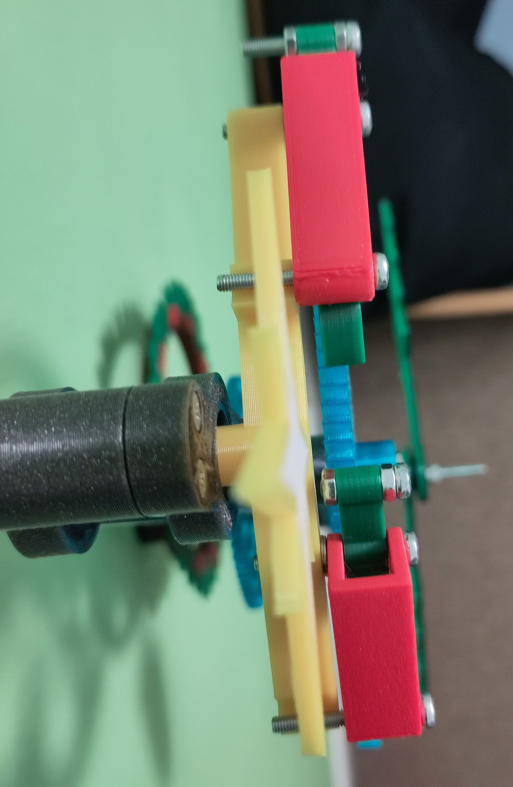
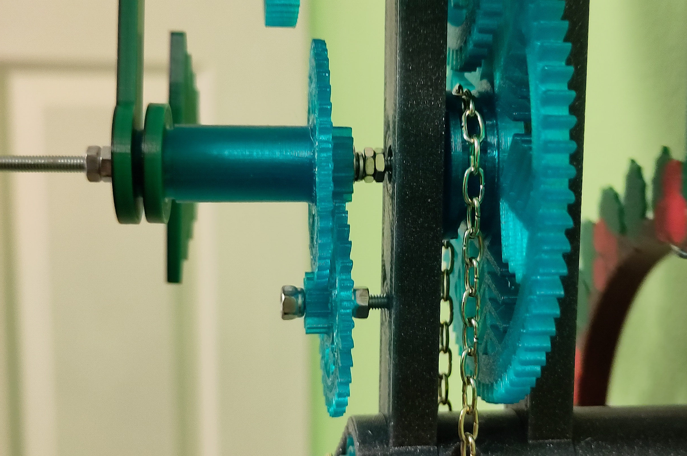
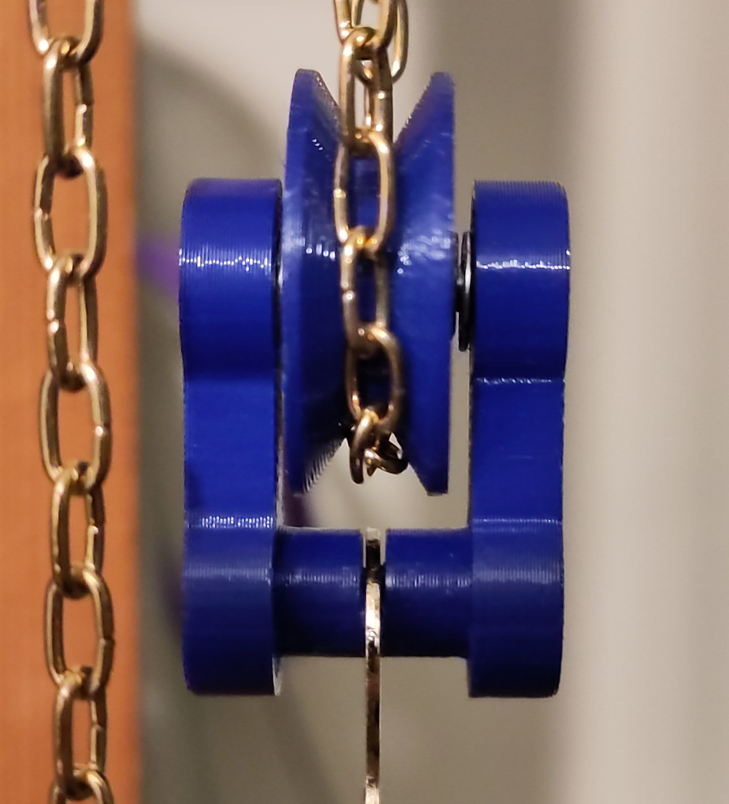

# Christmas Grasshopper

This is a mechanical pendulum clock that uses [John Harrison's grasshopper escapement](https://en.wikipedia.org/wiki/Grasshopper_escapement). It will run for 30 hours using a weight of approximately 1kg, if it is hung from a screw at a height of 1.8m. I have made no attempt at temperature compensation or proper pendulum suspension, but time keeping is surprisingly good (better than two minutes a week should easily be achievable).

Several elements of the print are intended to be printed multicoloured, but since I only have a single extruder printer they are designed to be printed by manually swapping filaments. See below for the details.

Note that this is not the easiest design to print and assemble. If you want to try your hand at a more simple clock, have a look at [my pendulum clock](https://www.printables.com/model/153792-pendulum-clock) (although it doesn't have a christmas version... yet!)

Everything is printed with PETG for strength. I don't expect PLA to work as it can deform under pressure. I have not tested ABS.

## Acknowledgements

- [Hugh Sparks' write-up on cycloidal gears](https://www.csparks.com/watchmaking/CycloidalGears/index.jxl).
- A small amount of source code is from [Dr Rainer Hessmer's gear generator](http://hessmer.org/gears/CycloidalGearBuilder.html) (MIT Licence).
- [The Modern Clock by Ward L Goodich](https://www.gutenberg.org/ebooks/61494) (and project Gutenberg!).
- [Computer Aided Design of Harrison Twin Pivot and Twin Balance Grasshopper Escapement Geometries by David Heskin](https://soptera.files.wordpress.com/2013/10/cad-twin-pivot-and-balance2.pdf) (His [other documents](https://soptera.wordpress.com/downloads/) and blog are worth looking at too).
- An honourary mention to [Brian Law's Wooden Clocks](https://www.woodenclocks.co.uk/). I would like to stress that my designs are my own, but I have taken inspiration and motivation from seeing what Brian has demonstrated to be possible.

## Bill Of Materials
- 8 3x10x4 bearings (3mm Internal diameter, 10mm external diameter, 4mm thick)
- 2 10x19x5 bearings (10mm internal diameter, 19mm external diameter, 5mm thick). See notes on bearings below
- Aprox. 2.5m cuckoo chain: 61 links per foot, 6.65x3.60mm link size (width x length) 0.9mm wire diameter. This is the standard for a 30 hour Regula cuckoo movement.
- Aprox. 2m of M3 threaded rod
- Suitable weight 750-1200g (see notes on bearings)
- 4 12mm M2 countersunk machine screws
- 4 M2 half height nuts
- 8 25mm M3 countersunk machine screws
- 4 25mm M3 pan head machine screws
- 1 10mm M3 pan head machine screw
- 1 20mm M3 pan head machine screw
- 2 20mm M3 countersunk machine screws
- 1 30mm M3 pan head machine screw
- 10 M3 nyloc nuts
- 3 M3 nut
- 2 M3 half height nuts
- 1 M3 spring washer
- 10mm length of steel pipe: 3mm internal diameter, 6mm external diameter (optional)

## Tools
- Small bench vice for inserting bearings
- Screwdrivers (big and small)
- Hacksaw
- File

## Multi-Colour on a non Multi-Material Printer
This is surprisingly easy to do and looks great when printed on a textured sheet. Since I don't own a multi-material printer I've used a variation on a technique I found on a [blog post](http://schlosshan.eu/blog/2019/03/02/prusa-i3-mk3-real-multicolour-prints-without-mmu/) that works with PrusaSlicer and my Prusa Mk3:

- I added a new printer to prusa slicer, and configured it with multiple extruders.
- I then added the custom G-code for "Tool change G-code" to be M600. This tells the printer to request the user to change the filament.
- When exporting gcode, I manually edit the file to remove the first M600 call - otherwise the printer asks you to change the filament immediately.
- Import all the STL files for the object at once - it should ask you if you want to treat them as a single object. Say yes!
- The object should be printed "upside down", so the manual filament changes are over fairly quickly, and the rest of the object can print without intervention.
- Using a wipe tower helps ensure there aren't any gaps or splurges in your print, but you can reduce the purge quantity a lot.
- When changing filament on the first layer, take special care to look for and remove any long stringing common with PETG.
- When changing filament, grab the extruded waste with pliers, but don't tug it away until you've confirmed it's succeeded and the print head starts to move away! It will extrude a short length after you've pressed the button to confirm.
- When changing filament, after you've removed one filament, check to see if the nozzle needs a clean before inserting the next filament.

Printing in PETG on a textured bed, with the 'front' of the object facing down results in a very neat and tidy front surface. With well tuned z-offset and elephant's foot then there will be no gaps and very little colour blurring at the boundaries between colours.

## Notes on bearings
This was the first clock I designed that uses larger diameter bearings and I ran into some unexpected issues. The 10mm internal diameter (ID) bearings have significantly more friction than the 3mm ID bearings I was used to. Dry running stainless steel 10mm ID bearings work fine.

I was unable to source dry-running bearings but was able to remove the grease from greased bearings by soaking in white spirits (mineral spirits in the US) overnight, drying, then soaking in IPA (Isopropyl Alcohol) before drying again. This reduced the friction on the bearings (3 and 10mm ID) to the point where they would spin freely.

IPA by itself doesn't work as well as white spirits, and I've not tested any other solvents. If you are unable to get the 10mm ID bearings to run completely free, I recommend just using one instead of two, skipping the front plate 10mm ID bearing.

The weight required to run the clock is extremely dependent on the friction in the bearings for the pendulum and anchor (top of the clock). The best I've achieved so far is 750g, but the clock can run with 1.25kg with one pre-greased 10mm ID bearing. 

Inserting the bearings into the clock plates may require a small bench vice.

## Printing the gears
It is vital to get the slicing right for the gears, as any extra friction introduced from printing artefacts will severely impact the reliability of the clock. I used seam painting for the gears to ensure that seams do not start on the teeth, springs or pallets of the anchor.

Nearly everything needs to be strong, so I sliced with 3 perimeters, 6 bottom and top layers and 40% gyroid infill.

PETG strings really quite a lot. This is exacerbated by any small bits of perimeter that can occur. I had to disable Gap Fill for the gears and then tweak the extrusion width for any pinions or wheels which showed signs of small lengths in the teeth. See wall_clock_17_xmas_wheel_2.3mf and the slicing screenshots. If I didn't do this then I didn't get a clean surface on the gear teeth, which meant a much heavier weight was required to overcome this friction.

The classic perimeter generator performs best for this (Arachne is the default for PrusaSlicer 2.5).

I hope the following images help make this more clear

For all the snowflake gears I have provided some alternative versions (a,b,c) which have different snowflake patterns.

### Chain wheel arbour
- wall_clock_17_xmas_wheel_0.stl is the main gear wheel
- wall_clock_17_xmas_chain_wheel_top_half.stl half of the chain sprocket wheel
- wall_clock_17_xmas_chain_wheel_bottom_half.stl the other half of the chain sprocket wheel

These three are attached together with two M2 countersunk screws and two M2 nuts. The ideal length of M2 screw is 12mm, but 10mm will do (although then you won't need the nuts) as will anything less than 14mm (it will just stick out the back a bit).

This then needs to be threaded onto a piece of M3 threaded rod 80mm long, with aproximately 5mm sticking out the back of the wheel.

I recommend a small amount of superglue to ensure that the chain wheel can't slip on this threaded rod. This is important so that the hands can be set without the threaded rod moving.

### Second wheel arbour
- wall_clock_17_xmas_wheel_1.stl
- wall_clock_17_xmas_wheel_1_arbour_extension_front.stl

These need to be threaded onto a length of M3 threaded rod approximately 25mm long, with equal amounts of threaded rod sticking out each side.

If they are a snug fit there is no need for glue. The fit seems to vary slightly depending on exactly which filament I've used.

Note that the "arbour extension" should go with the small lip on the outside of the wheel - this will be pressed up against the bearing, so the lip is to ensure it doesn't foul on the non-rotating parts of the bearing.

### Escape wheel arbour
- wall_clock_17_xmas_wheel_2.stl
- wall_clock_17_xmas_wheel_2_arbour_extension_rear.stl
- wall_clock_17_xmas_wheel_2_escape_wheel.stl

Thread the pinion (wall_clock_17_xmas_wheel_2.stl) and arbour extension onto a 60mm length of M3 threaded rod. Leave aproximately 5mm of threaded rod out the back. The pinion needs to be firmly fixed to the rod, I recommend a small amount of superglue.

Push a nyloc nut into the front of the escape wheel. It won't be threaded onto the rod until the plates are assembled.

### Anchor arbour
- wall_clock_17_xmas_arbour_3_anchor.stl (yellow in the photos)
- wall_clock_17_xmas_arbour_3_anchor_white.stl
- wall_clock_17_xmas_arbour_3_collet.stl
- wall_clock_17_xmas_arbour_3_pendulum_holder.stl
- wall_clock_17_xmas_grasshopper_entry_composer.stl (red in the photos)
- wall_clock_17_xmas_grasshopper_exit_composer.stl (red in the photos)
- wall_clock_17_xmas_grasshopper_entry_pallet_arm.stl (green in the photos)
- wall_clock_17_xmas_grasshopper_exit_pallet_arm.stl (green in the photos)

The anchor is a multicolour object (anchor and anchor_white), with a star for decoration.

A length of M3 threaded rod should be threaded into the anchor - be careful not to puncture through the front! It may need to be superglued in place to avoid being loose.

The collet and pendulum holder use a half height M2 nut and 5mm countersunk M2 machine screw each. In a pinch any M2 machine screw will do for the collet and the pendulum holder has enough friction that it will probably be okay without.

The nut goes inside the square part of the collet or pendulum holder, and the screw goes in through the bottom to grip the nut.

The composers need a 25mm M3 screw through the hole by the end of the arm. This provides weight for the composer to fall in the right direction, and also prevents the composer falling further than it should be resting on the anchor.

The entry pallet arm has a 10mm panhead M3 screw with two nuts through one end. The exit pallet arm has a 20mm pan head M3 screw and two nuts through one end. 

The entry composer and pallet arm slot onto a 25mm pan head M3 screw. This is then screwed into the anchor with a washer between the anchor and composer. They need to be free enough to fall under their own weight.

If it is assembled correctly then the pallet arms will raise themselves freely, until they reach the composers. The composers will rest on their slots on the frame, preventing the pallet arms from raising up further. If pushed up, the pallet arms will raise the composers.

I hope that between the following photos and the 3D model this isn't too hard to follow!

Once the plates are assembled, the collet and pendulum holder will slot onto the square bit at the back and the screws used to hold them both securely in place.

## Printing the clock plates
The clock plates (printed in sparkly grey in the photo) consist of the following parts:
### Bottom Standoff
- wall_clock_17_xmas_bottom_standoff.stl
This can be printed with default settings - it doesn't need much strength or infill. This will go at the bottom of the back of the clock.
### Top Standoff
- wall_clock_17_xmas_top_standoff.stl
This needs to be strong. I recommend 4 perimeter walls.

A 3mm ID bearing needs to be pressed into the bearing holder. I recommend a dry or degreased bearing for this.

### Back Plate
- wall_clock_17_xmas_back_plate_textcolour.stl
- wall_clock_17_xmas_back_plate_platecolour.stl
The two files can be combined to form a multicolour print. If you don't want to print the text on the back in a separate colour, just print back_plate_platecolour.

This has holes in the pillars intended to hold print-in-place M3 full sized nuts. There are eight nuts in total, at two different heights. I recommend using “Change Colour” in PrusaSlicer rather than “Pause Print”, as it keeps the nozzle heated and does a mini-purge afterwards, so you don't end up with a gap in the print.

This also needs to be strong. I recommend 4 perimeter walls. Printing at -51degrees works well on my mk3 as it leaves the print head clear of the pillars, making it easy to slot in the print-in-place nuts. At -51 degrees setting the Fill angle (Infill, Advanced) to 84degrees maintains the 45degree infill relative to the plates. I suspect this helps improve strength slightly.

Bearings will need to be pressed into the bearing holders on the back plate. I recommend a dry or degreased bearing for the 10mm ID bearing at the top.

An M3 nyloc nut needs pushing into the hexagonal hole on the top of the bottom pillar.

The top and bottom standoffs can be attached to the back of the back plate with 25mm countersunk M3 screws
### Front Plate
- wall_clock_17_xmas_front_plate.stl

I recommend printing with the same settings as the back plate.

Bearings will need to be pressed into the bearing holders on the front plate. If you are unable to get hold of dry-running bearings, you can skip the 10mm ID bearing at the top of the front plate, leaving that hole empty.

Screw a 25mm countersunk M3 machine screw into the front plate, from the back, below the bottom bearing. This will hold part of the motion works.

## Assembling the gears and plates

The bottom three arbours should be slotted into the bearings on the back plate first. Then slot the front plate onto the tops of the arbours. Use 25mm counter sunk M3 screws to attach the front plate to the back plate.

Now you can thread the escape wheel (the largest gear) onto the front of the top threaded rod. It needs roughly 1mm of clearance from the front bearing. To secure this so it can't rotate independently, thread an extra M3 nut onto the front of the rod. Then tighten it against the nyloc nut. The escape wheel and pinion on this arbour should not be able to rotate independently of each other.

Once the front plate is attached, the anchor should slot through from the front. Onto the back, slot first the collet (the side with a slightly raised inner circle should go with the raised circle pressed up against the bearing on the back of the back plate.) then slot the pendulum holder. Once the anchor is pushed all the way in, with the threaded rod slotting into the bearing in the top standoff, screw the collet in place. The pendulum holder needs to be roughly centred between the wall and back plate before tightening its screw.

### Hands
- wall_clock_17_xmas_minute_hand_green.stl
- wall_clock_17_xmas_minute_hand_brown.stl
- wall_clock_17_xmas_minute_hand_black.stl
- wall_clock_17_xmas_minute_hand_hold.stl
- wall_clock_17_xmas_minute_hand_red.stl
- wall_clock_17_xmas_hour_hand_green.stl
- wall_clock_17_xmas_hour_hand_brown.stl
- wall_clock_17_xmas_hour_hand_black.stl
- wall_clock_17_xmas_hour_hand_hold.stl
- wall_clock_17_xmas_hour_hand_red.stl

The hands are multicolour prints made up of five files for each hand.

### Motion Works
- wall_clock_17_xmas_motion_arbour.stl
- wall_clock_17_xmas_motion_cannon_pinion.stl
- wall_clock_17_xmas_motion_hour_holder.stl

The motion works are the three gears on the front of the clock which hold the hands. They should be printed with the same settings as the rest of the gears.

The hour holder slots over the top of the cannon pinion. The minute hand slots onto the square slot on the end of the cannon pinion and the hour hand slots onto (funnily enough) the hour hand holder.

The hour holder should be able to rotate freely when slotted over the cannon pinion.

Once the plates have been assembled by following the instructions so far, screw two half-height M3 nuts onto the bottom arbour (the one with the chain wheel). Use two pairs of pliers (needle nose are probably best here) to lock the nuts against each other. Hold each night in a pair of pliers and turn the nuts against each other. The idea is that they should be held tightly against the rod, unable to rotate freely. I advise against using glue, as this would make it impossible to ever disassemble the clock.

Next slot an M3 spring washer over the rod, followed by a flat washer. Before slotting the cannon pinion on, thread a nyloc nut and then slot the motion arbour onto the machine screw just below this rod. Thread a final nyloc nut over the motion arbour. The two nyloc nuts hold the motion arbour in roughly the right place, and it will be easier to adjust them properly in a moment.

Next slot the cannon pinion, followed by the hour holder onto the rod with the spring washer. Once these are in place you can check to see if the nyloc nuts are holding the motion arbour in the right place.

Slot the hour hand onto the hour hand holder - this is just held on with friction - and make sure it's not too wonky. Then slot the minute hand onto the cannon pinion. Finally, put a washer and two M3 nuts on top. Tighten the first nut until there is some resistance to rotating the hands. The aim is for the spring washer to be slightly compressed - this ensures the hands can be turned manually to set the time, but otherwise are turned by the clock. Tighten the second nut against the first nut (same technique as before, using two pairs of pliers to thread the nuts against each other). This should hold the nut in place well enough that you can rotate the hands in both directions without the screws undoing themselves.

The following photo shows how it should look when assembled correctly:

To line the hands up correctly, set the time to 12 o'clock, manually re-aligning the hour hand if necessary, before turning just the minute hand to set the time.

### Ratchetted chain wheel
- wall_clock_17_xmas_huygens_chain_wheel_with_click.stl
- wall_clock_17_xmas_huygens_chain_wheel_top_half.stl

Called the 'hyugens wheel' because this, combined with the pulley and chain, provides [maintaining power](https://en.wikipedia.org/wiki/Maintaining_power#Huygens) to the clock, necessary to keep the grasshopper escapement running while winding the clock.

Print the two halves like gears, using the paint on seam to ensure the arms of the ratchet do not contain any seams. The classic slicer is needed here to ensure the ratchet arms print in one continuous line.

Use two 12mm countersunk M2 screws and half-height nuts to attach the two halves of the wheel together.

Attach the chain wheel to the bottom of the front plate using a 30mm M3 pan head screw. Sandwich the wheel between two washers to help it rotate freely.

### Pulley
- wall_clock_17_xmas_lightweight_pulley_wheel.stl or wall_clock_17_xmas_no_pipe_lightweight_pulley_wheel.stl
- wall_clock_17_xmas_lightweight_pulley_holder_b.stl
- wall_clock_17_xmas_lightweight_pulley_holder_a.stl

Print these parts with 4 perimeters for strength. Despite the overhang, the pulley wheel prints okay with 0.2mm layer height.

The pulley wheel is intended to have a 8mm length of steel pipe (3mm internal diameter, 6mm external diameter) slotted into the centre. If you don't have steel pipe, use the no_pipe version, but I expect it might wear a bit faster.

The pulley is fixed together with two 20mm M3 countersunk machine screws with nyloc nuts. For my weight I slotted a cuckoo weight hook over the bottom arm of the pulley before screwing it together. For your own weights, a length of wire may work better. I have put washers between the steel pipe and the pulley holders on one pulley I assembled, but I don't think they make much difference.

The pulley wheel needs to be free running, so the top screw shouldn't be tightened fully.

## Pendulum
The pendulum consists of an 85cm and 16cm length of M3 threaded rod, a 'hand avoider' (used on this design to avoid the bottom standoff) and a bob.

### 'Hand avoider' wreath
- wall_clock_17_xmas_hand_avoider_brown.stl
- wall_clock_17_xmas_hand_avoider_green.stl
- wall_clock_17_xmas_hand_avoider_red.stl

This is a multicolour print, styled as a simple holly wreath. This needs to be as light as possible (to avoid having to make the bob extra heavy or the pendulum extra long) so I recommend printing with 2 perimeter walls and no infill.

Push a nyloc nut into the top and bottom of the wreath and then thread the M3 rod into the top and bottom.

Thread a nyloc nut onto the top of the shorter length of rod - this will be the end that slots into the pendulum holder on the anchor arbour.

### Pendulum Bob
- wall_clock_17_xmas_bob_pud_black.stl
- wall_clock_17_xmas_bob_pud_brown.stl
- wall_clock_17_xmas_bob_pud_green.stl
- wall_clock_17_xmas_bob_pud_red.stl
- wall_clock_17_xmas_bob_pud_white.stl
- wall_clock_17_xmas_bob_lid.stl
- wall_clock_17_xmas_bob_nut.stl

The bob is a multicolour print. This is best printed with a 0.2mm layer height or less to ensure the hole for the rod is large enough (it gets a bit oval at larger layer heights).

The lid and nut are normal prints, and work well in brown. The bob is hollow, intended to be filled with something heavy. I use steel shot (like for shotguns) which is available easily even in the UK. I expect that sand would work if the lid is sealed.

The lid on the back of the bob is held in place with two 8mm M3 pan head screws.

A nyloc nut should be pushed into the nut. This is so it won't unscrew itself as the pendulum swings.

Put the nut in the centre of the bob and thread the whole bob, with nut, onto the bottom of the longer length of rod on the pendulum. The bob should be loose and the nut should not.

Raising and lowering the nut will alter the timekeeping of the clock. The back of the bob is marked S and F, for slow and fast, to help you remember which way to turn the nut. A shorter pendulum runs faster and a longer pendulum slower.

The top of the pendulum, with the nyloc nut, should slot into the pendulum holder. You may need to rotate the nut slightly the first time you slot it in.

## Chain
The final part of the assembly is the chain! Cuckoo chain links can be easily bent with pliers, which is how a continuous loop is made. Starting from the left side of the clock, feed the chain:
- Through the left hole in the bottom pillar
- Over the chain wheel
- Through the right hole in the bottom pillar
- Through the pulley
- Into the right hole in the front plate (by the ratchet wheel)
- Over the ratchet (you can twist the ratchet wheel to make this easier)
- Down through the left hole in the front plate (by the ratchet wheel)

Then finally close the loop. The total length of the chain can be adjusted based on how high you've hung the clock. For the full 30hours runtime, put a screw at 1.8 above the ground.

# Notes
Thank you for looking at my clock, I hope these instructions are clear enough to follow - if they aren't please leave a comment and I will be happy to help!

My clocks are generated from a python library I wrote from scratch. I'm investigating suitable open source hardware licences and if there's some interest (or anyone can give me advice on licencing) I will look into releasing the source.